<h1 align="center">📋 Complain App </h1>

<p align="center">
  <strong>A comprehensive complaint management application for drivers and supervisors</strong>
</p>

<p align="center">
  Submit complaints • Track status • Manage reports — streamlined workflow
</p>

<p align="center">
  
</p>

## 👥 User Roles

### 🚗 Driver Features
- **Submit Complaints**: Create new complaints with detailed descriptions
- **Track Status**: Monitor complaint progress in real-time
- **View History**: Access complete complaint history
- **Upload Documents**: Attach photos and documents as evidence
- **Receive Updates**: Get notifications on status changes

### 👨‍💼 Supervisor Features
- **View All Complaints**: Access comprehensive complaint dashboard
- **Manage Status**: Update complaint status and priority levels
- **Assign Tasks**: Delegate complaints to appropriate departments
- **Generate Reports**: Create detailed analytics and summaries
- **Communication Hub**: Send updates and messages to drivers
- **Historical Analysis**: Review trends and complaint patterns

## 🛠️ Tech Stack

- **React Native** - Cross-platform mobile development
- **React Navigation** - Screen navigation management
- **Native Base / React Native Elements** - UI component library

## 🖼️ Screenshots

<div align="center">
  <p>
    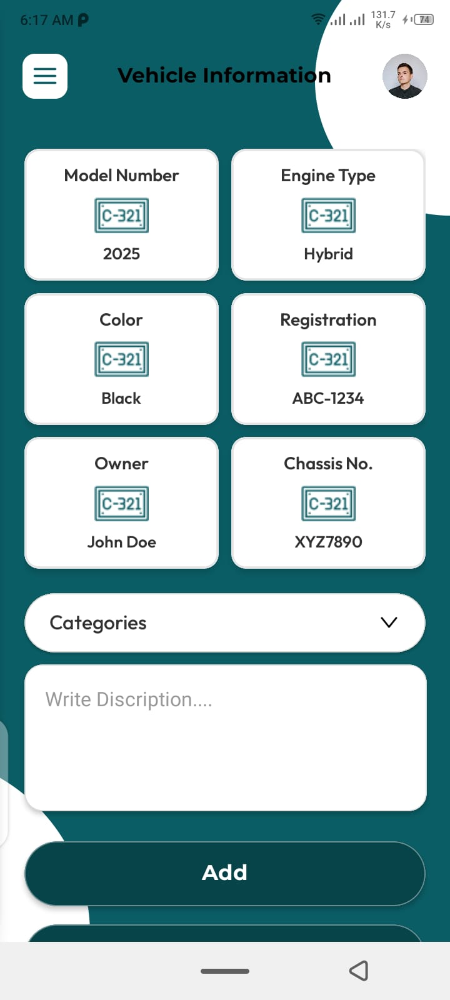
    
    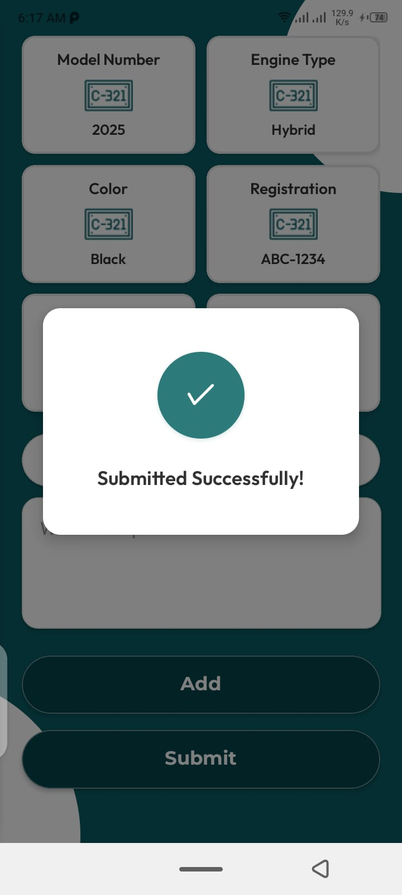
    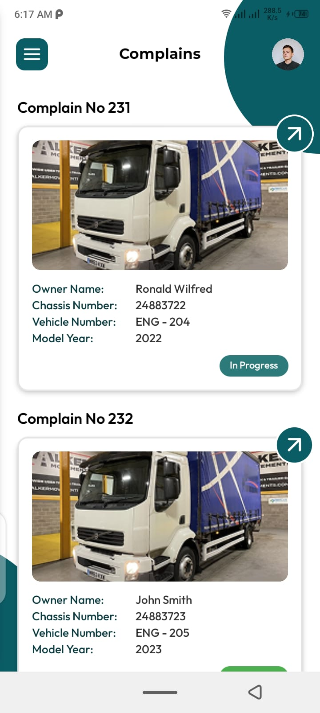
    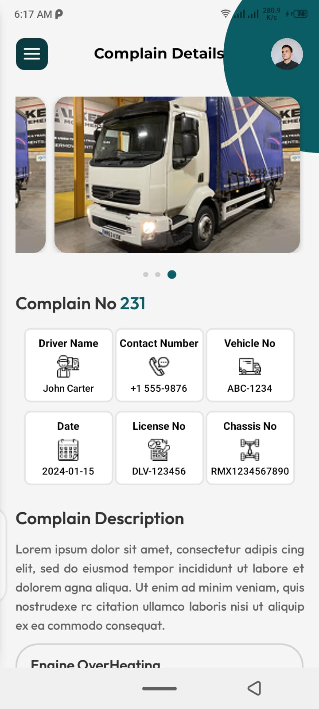
    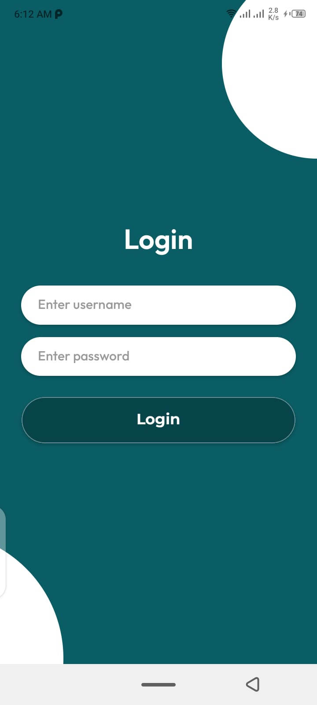
    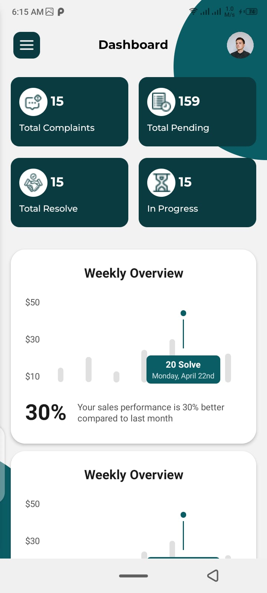
    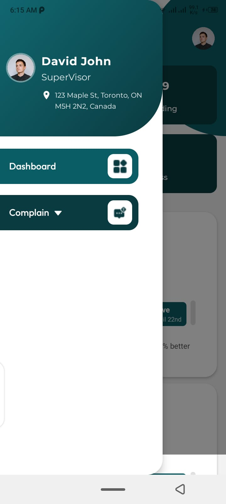
    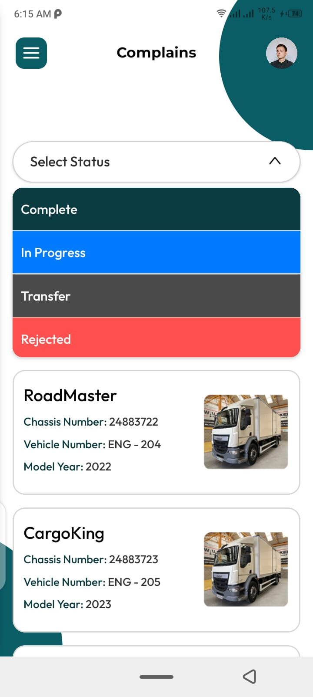
    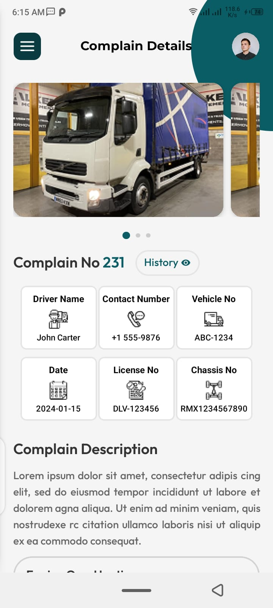
    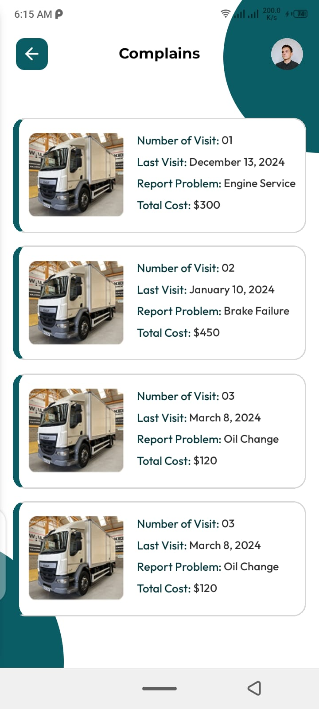
    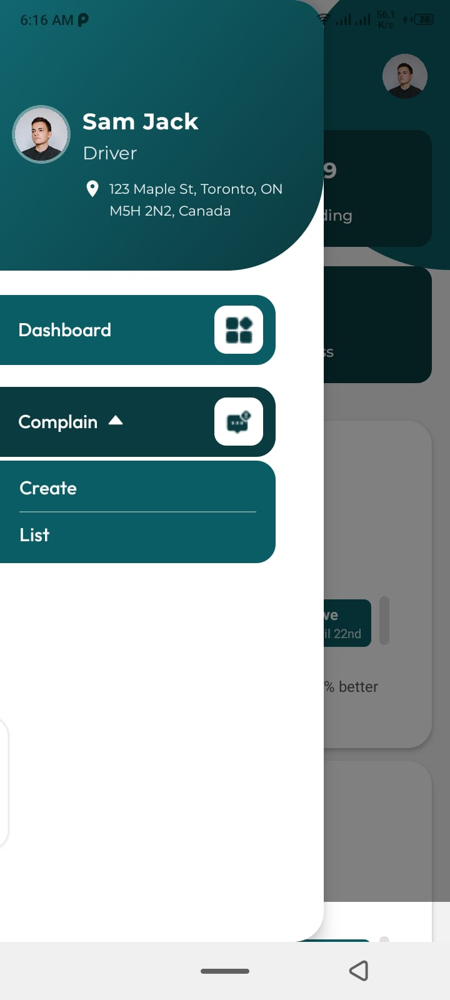
    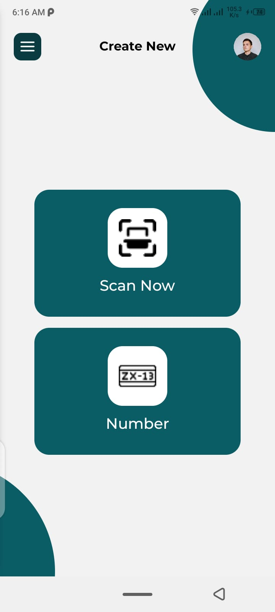
    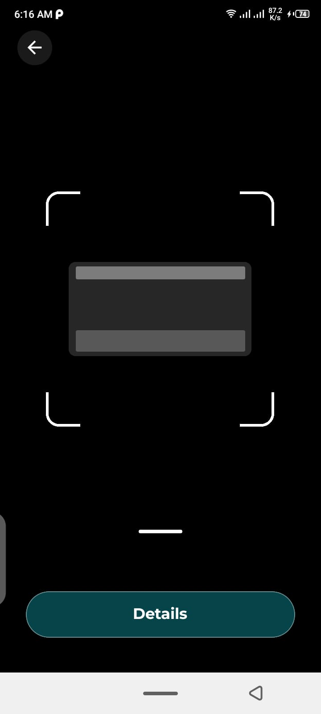
  </p>
  

</div>

## 🚀 Getting Started

### 📋 Prerequisites

Before you begin, ensure you have the following installed:

- **Node.js** (v16 or higher)
- **npm** or **yarn**
- **React Native CLI**
- **Android Studio** (for Android development)
- **Xcode** (for iOS development - macOS only)
- **MongoDB** (local installation or cloud instance)

### 📱 Frontend Setup

1. **Clone the repository**
   ```bash
   git clone https://github.com/your-username/complaint-tracker-app.git
   cd complaint-tracker-app
   ```

2. **Install dependencies**
   ```bash
   npm install
   # or
   yarn install
   ```

3. **Start the development server**
   ```bash
   # For React Native CLI
   npx react-native run-android  # Android
   npx react-native run-ios      # iOS (macOS only)
   
   # For Expo CLI (if using Expo)
   npx expo start
   ```

## 🤝 Contributing

We welcome contributions to improve the ComplaintTracker app! Here's how you can help:

### Getting Started with Contributions

1. **Fork the repository**
   ```bash
   git clone https://github.com/your-username/complaint-tracker-app.git
   ```

2. **Create a feature branch**
   ```bash
   git checkout -b feature/new-feature-name
   ```

3. **Make your changes**
   - Follow React Native best practices
   - Test both driver and supervisor interfaces
   - Ensure responsive design

4. **Commit your changes**
   ```bash
   git commit -m "✨ Add new feature description"
   ```

5. **Push and create a Pull Request**
   ```bash
   git push origin feature/new-feature-name
   ```

### Development Guidelines

- **Code Style**: Follow ESLint and Prettier configurations
- **Testing**: Test features on both user roles
- **Documentation**: Update README for new features
- **UI/UX**: Maintain consistent design across interfaces

---

## 📧 Contact

<div align="center">

<h2 align="center"><strong>Muhammad Adeel</strong></h2>

<h3 align="center">🚀 Full Stack Developer</h3>

[](mailto:your.email@gmail.com)

*Questions about the app or need technical support? Feel free to reach out!*

</div>

## 📄 License

This project is licensed under the **MIT License** - see the [LICENSE](LICENSE) file for details.

MIT License - Open source and free to use for educational and commercial purposes.

<div align="center">
  <h3>💙 Built with dedication to improve workplace communication</h3>
  <p><em>Streamlining complaint management for better workplace efficiency</em></p>
</div>
